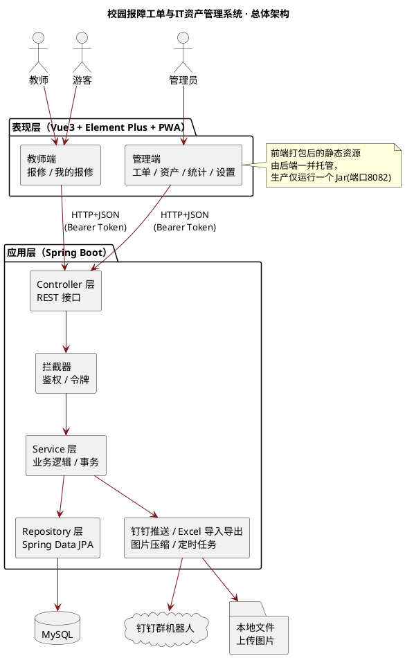
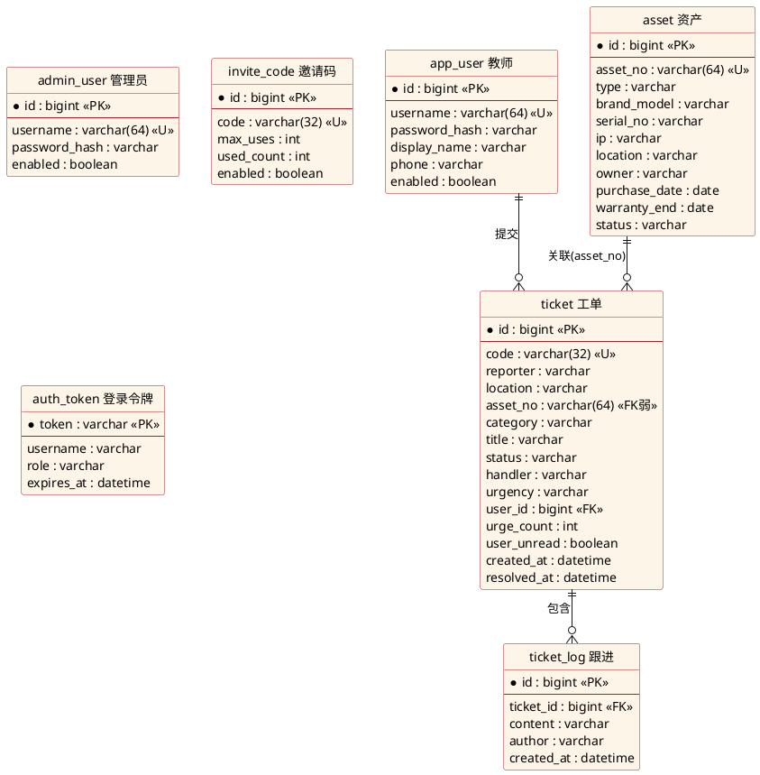
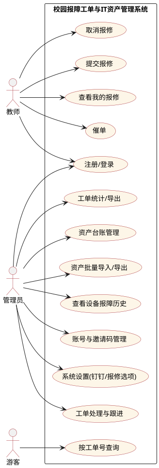
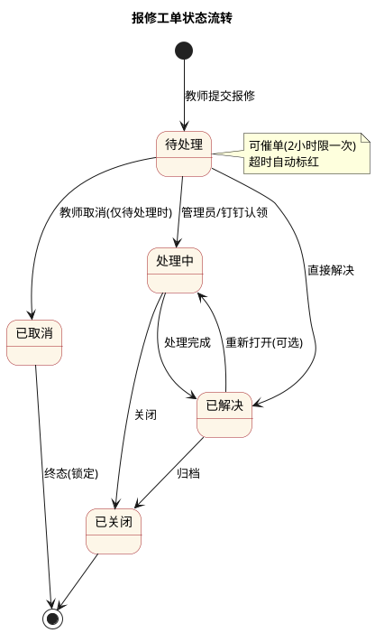

# 论文配图源码（PlantUML）

> 用法：
> 1. 在线渲染：打开 https://www.plantuml.com/plantuml ，把 `@startuml ... @enduml` 之间（含首尾）的内容粘贴进去，即可生成 PNG/SVG。
> 2. VS Code：安装 "PlantUML" 插件，`Alt+D` 预览，右键可导出图片。
> 3. 需要本地渲染时需装 Java + Graphviz。
>
> 三张核心图：系统架构图、数据库 E-R 图、用例图。另附报修流程状态图。

---

## 图1 系统总体架构图

---

## 图2 数据库 E-R 图

> 说明：`asset` 与 `ticket` 通过资产编号 `asset_no` 弱关联（非外键约束，选填），体现"设备—工单"打通。`system_setting`（键值表）为独立配置表，图中省略。

---

## 图3 用例图

---

## 图4 报修工单状态流转图（活动/状态图）

