# 校园报障工单系统 · 产品说明书（图文版）

> 石室联中132 · 后勤报修 ｜ 老师扫码报修 → 管理员接单处理 → 钉钉群实时通知
> 版本：2026.07　适用：成都市石室联中132学校

---

## 一、这是什么

一套给学校用的"设备报修 / 后勤报障"小系统。老师发现教室投影坏了、灯管不亮、插座松动等问题，随手在手机上提交；后勤管理员在后台接单处理；全过程在**钉钉群**实时通知，处理进度老师随时可查。

| 角色 | 入口 | 主要功能 |
|------|------|----------|
| 老师（报修人） | 手机打开网址 / 扫码 | 提交报修、查进度、催单、取消 |
| 管理员（后勤） | 后台管理页 | 接单、处理、写跟进、改状态、统计、导出 |
| 钉钉群 | 群里的通知卡片按钮 | 一键认领 / 已解决 / 取消 |

**访问地址**
- 报修与查询（老师）：`http://43.136.56.131:8082/`
- 后台管理（管理员）：`http://43.136.56.131:8082/admin/login`

> 建议把老师入口生成二维码，贴在各教室/办公室，扫码即用。

---

## 二、老师使用指南（手机端）

### 1. 注册 / 登录

首次使用点「注册」，填写用户名、密码和**邀请码**（向管理员索取）；之后用账号密码登录。

<table>
<tr>
<td align="center">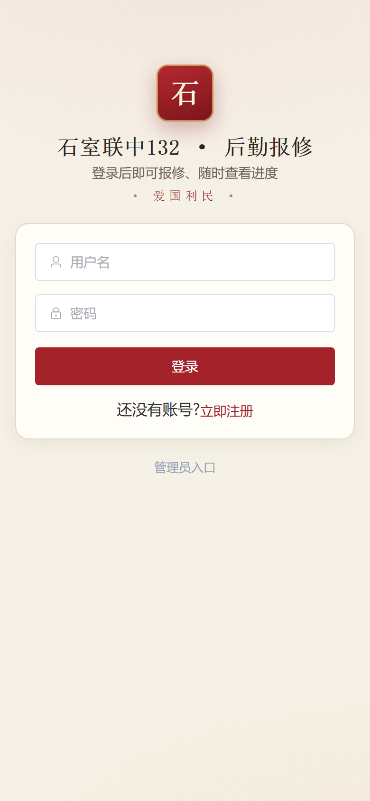 登录</td>
<td align="center">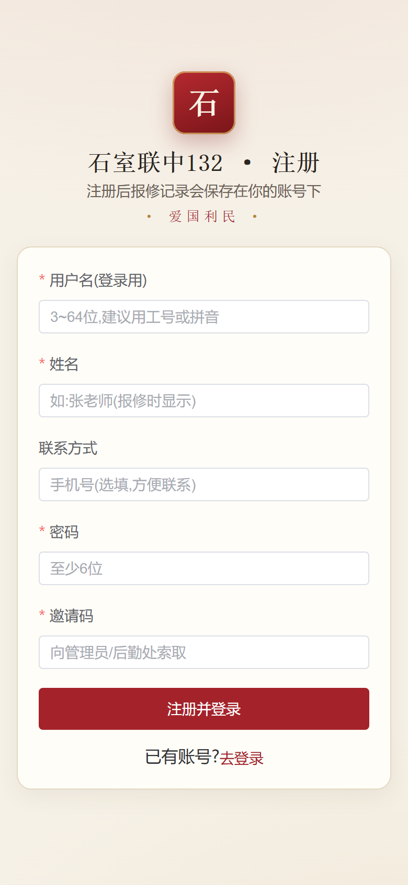 注册（需邀请码）</td>
</tr>
</table>

### 2. 提交报修

进入「我要报修」，选择**故障类型**、填写**位置**、**问题描述**，**可拍照上传**（手机原图会自动压缩，不占流量），提交后生成工单号，钉钉群同步收到通知。

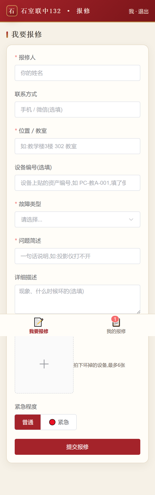

> 页面顶部有「常见问题」，很多小问题可先自助解决，不必报修。

### 3. 查看进度 / 催单 / 取消

进入「我的报修」查看自己所有工单及状态；点开可看处理进展。

<table>
<tr>
<td align="center">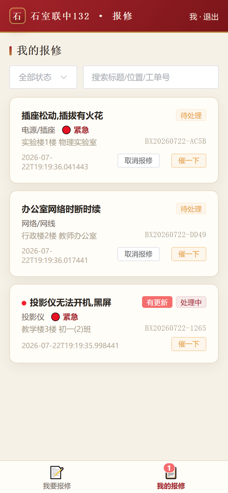 我的报修列表</td>
<td align="center">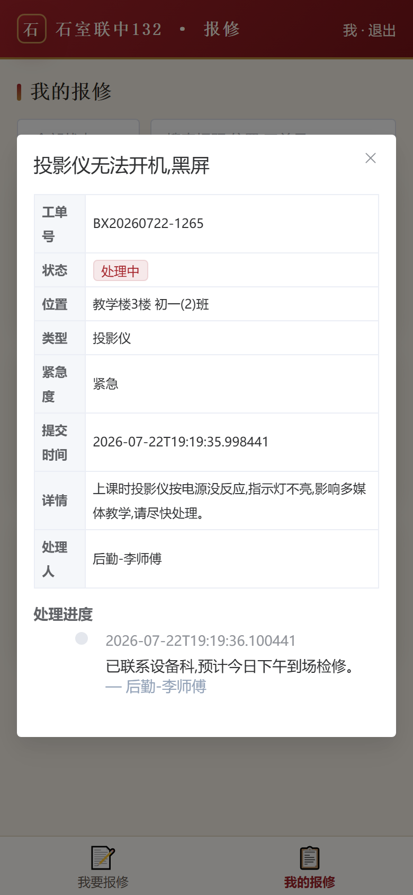 工单详情/进展</td>
</tr>
</table>

- **有更新红点**：后勤处理有进展时会出现红点提醒，点开即消。
- **催一下**：长时间未处理可催单（同一工单 2 小时限 1 次），钉钉群收到催单提醒。
- **取消报修**：**仅"待处理"**（后勤还没接手）时可自行取消；已接手则不能取消。

---

## 三、管理员（后勤）使用指南

后台登录 `/admin/login`，初始账号 **admin / Gongdan@2026**（**首次登录后请立刻改密码**）。

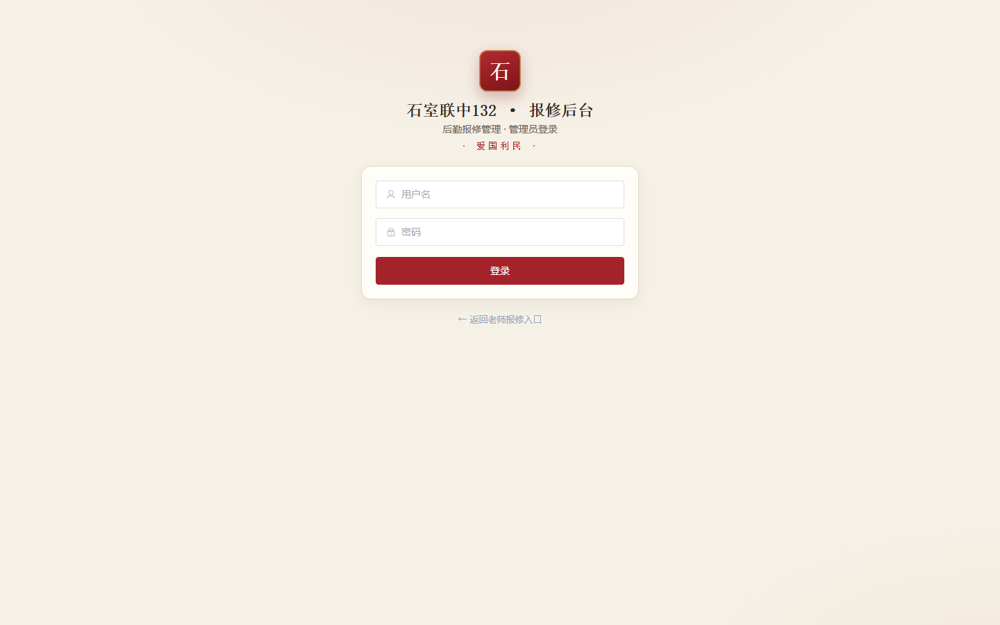

### 1. 工单管理

列表默认**最新置顶**，支持按状态、类型、关键词、工单号筛选 + 分页；超时工单整行标红并显示「超时」。

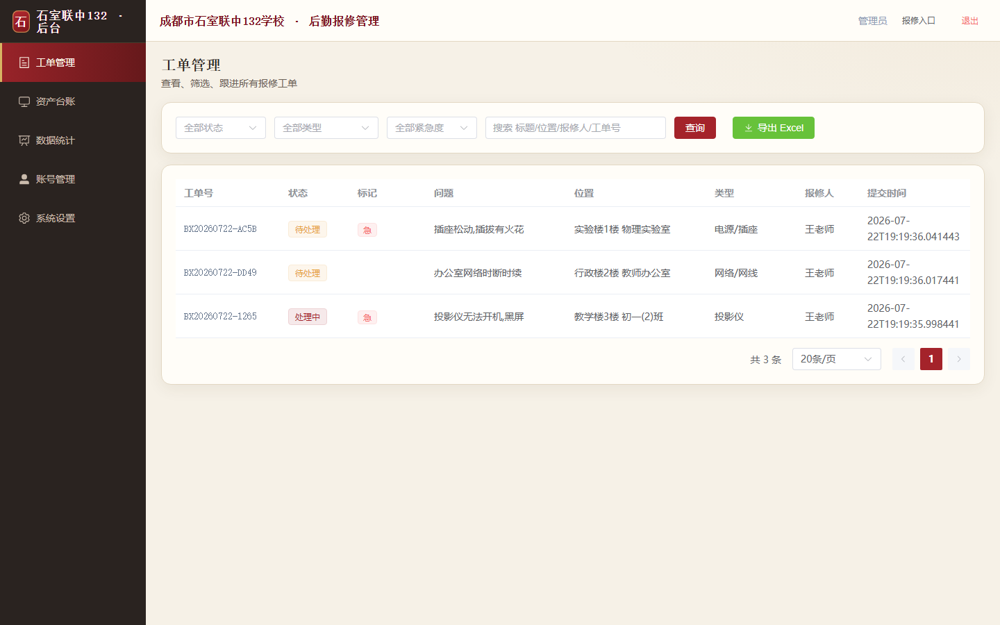

点开工单进入详情：查看报修内容与照片、**修改状态**、**添加跟进记录**。每次改状态/加跟进，报修老师会收到"有更新"红点。

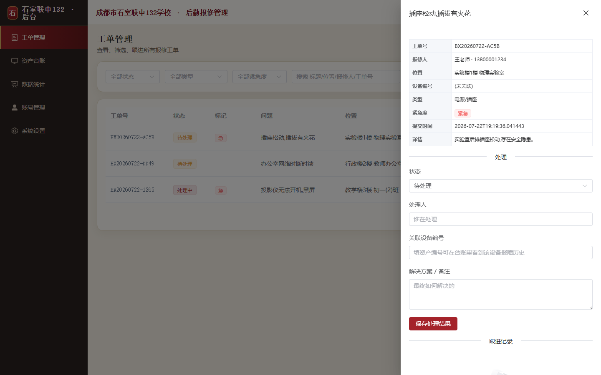

### 2. 工单状态说明

| 状态 | 含义 | 谁能设置 |
|------|------|----------|
| 待处理 | 刚提交，等后勤接单 | 系统自动 |
| 处理中 | 后勤已认领，正在处理 | 管理员 / 钉钉「认领」 |
| 已解决 | 问题已修复 | 管理员 / 钉钉「已解决」 |
| 已关闭 | 归档结束 | 管理员 |
| 已取消 | 报修人自行取消 | 老师 / 钉钉「取消」 |

> **终态锁定**：`已解决 / 已取消 / 已关闭` 为终态，钉钉群按钮对终态工单不再生效；如需变更（如重开），请在**后台管理**里操作。

### 3. 数据统计

按状态、时间等维度出图表，掌握报修量、处理情况与积压趋势。

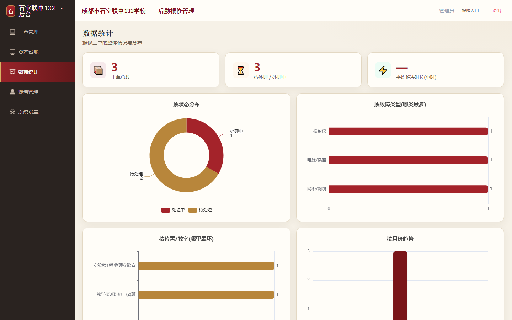

### 4. 账号管理（三个标签）

**管理员账号 / 老师账号 / 注册邀请码**：新增停用改密、老师账号管理、生成邀请码发给老师注册（可设备注和使用次数上限）。

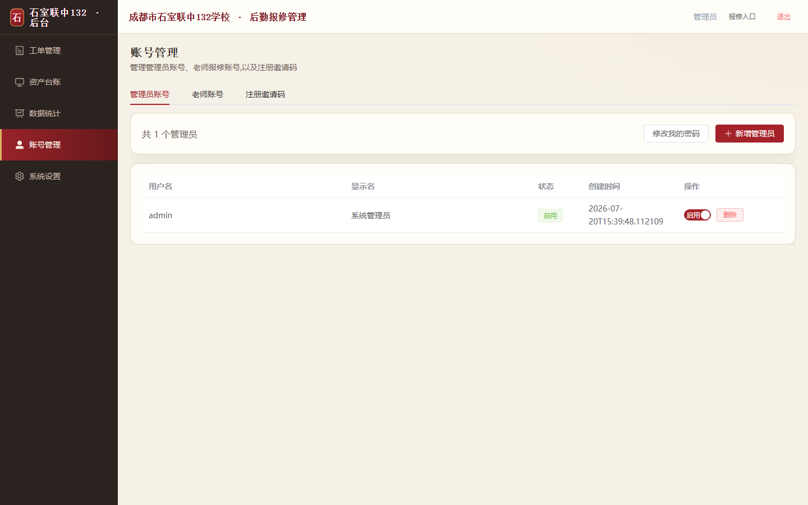

> ⚠️ 换服务器/新库时邀请码表为空，老师无法注册——需先在这里生成邀请码。

### 5. 系统设置

配置**钉钉通知**（群机器人 Webhook、安全设置、群内按钮地址）与**报修选项**（故障类型、常用位置、常见问题、超时小时数）。

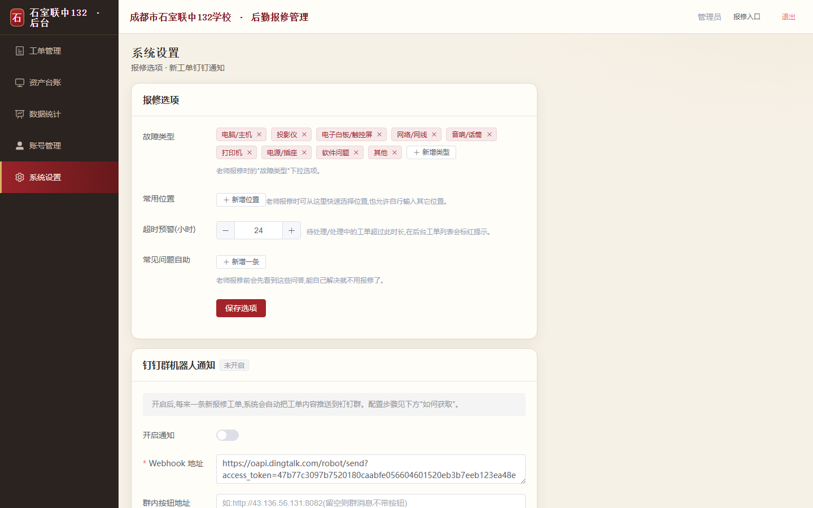

### 6. 导出

工单管理页可一键**导出 Excel**，用于台账、月报、汇总。

---

## 四、钉钉群操作

配置好群机器人后，每来一条新工单，群里会收到**通知卡片**（紧急工单红色标注），卡片带三个按钮：🙋认领 / ✅已解决 / 🚫取消。

### 1. 点按钮 → 先弹确认框（防误触）

点任意按钮会先打开**确认页**，显示工单号、当前状态和要执行的动作，点「确认」才真正改状态，三种动作用**不同颜色**区分：

<table>
<tr>
<td align="center">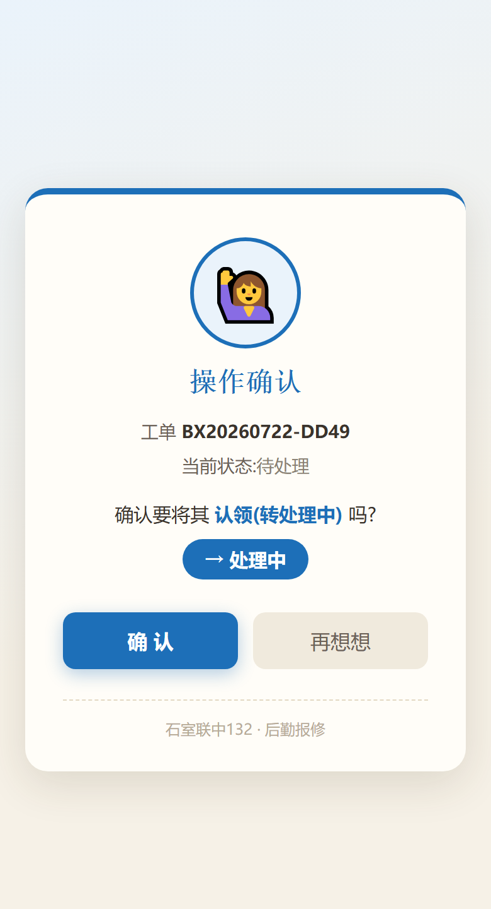 认领 → 处理中（蓝）</td>
<td align="center">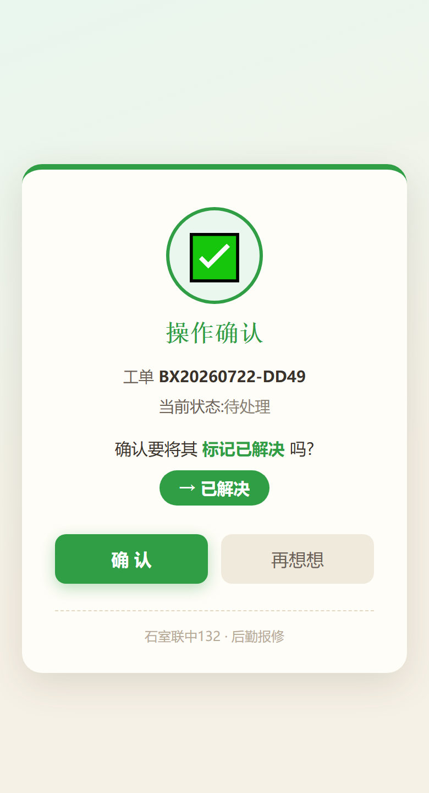 标记已解决（绿）</td>
<td align="center">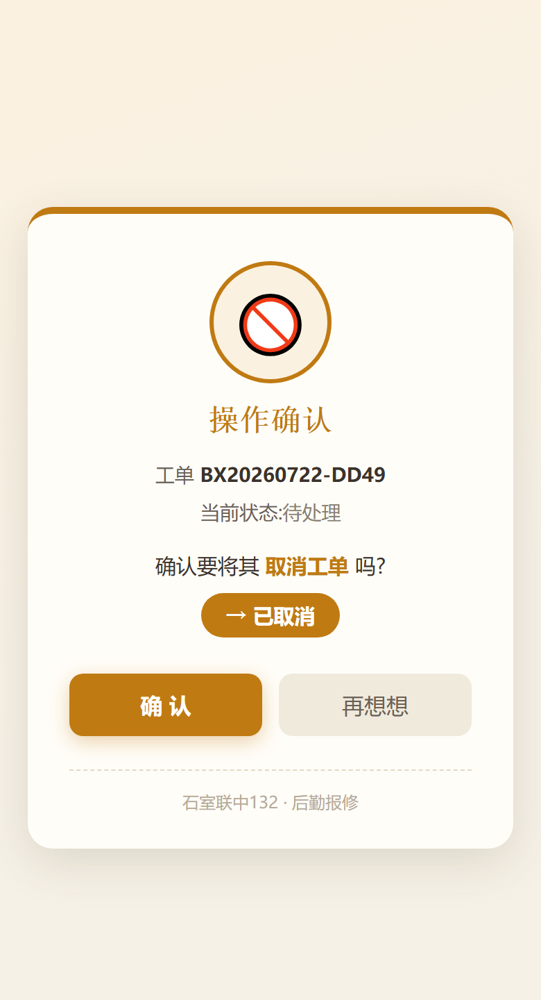 取消工单（橙）</td>
</tr>
</table>

### 2. 确认后 → 结果页

<table>
<tr>
<td align="center">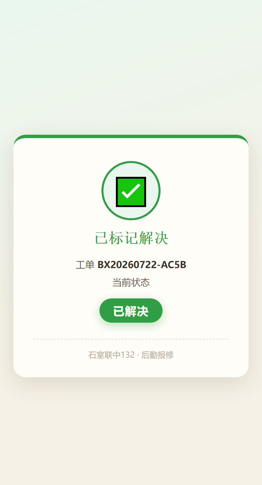 操作成功（按状态配色）</td>
<td align="center">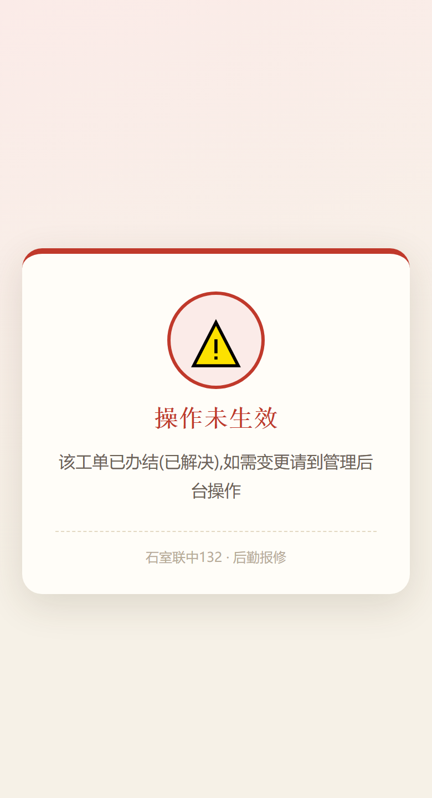 终态工单被拦截（红）</td>
</tr>
</table>

- **终态工单**（已解决/已取消/已关闭）点按钮会提示"操作未生效"，不会误改。
- 群机器人按钮无法识别点击人，故"认领"不记录具体认领人；每次群操作都会在工单里留一条「钉钉群操作」记录。

---

## 五、常见问题（FAQ）

**Q：老师注册提示需要邀请码？**　A：向管理员索取，在「账号管理 → 注册邀请码」生成。

**Q：报修照片占流量吗？**　A：不会，上传自动压缩（几 MB 压到约 200~400KB）。

**Q：提交后想撤回？**　A：「我的报修」里**待处理**状态可取消；已被接手则联系后勤。

**Q：钉钉点了按钮提示未生效？**　A：该工单已是终态（已解决/已取消/已关闭），需变更请到后台操作。

**Q：忘记管理员密码？**　A：由其他管理员在「账号管理」重置。

**Q：换服务器后钉钉/邀请码失效？**　A：这些存在数据库，换库需重新配置钉钉、重新生成邀请码。

---

## 六、注意事项

- **首次务必修改默认管理员密码**（admin / Gongdan@2026）。
- 当前对外为 `http://`（明文），建议尽快配置 **HTTPS**（域名 mm1.asia 已备案，可在宝塔配子域反代 + 证书）。
- 报修照片默认保留 15 天后自动清理（主要用于处理期查看）。
- 移动端已适配，支持"添加到桌面"（PWA），像 App 一样使用。

---

## 七、技术信息（给维护者）

- 架构：Spring Boot 3 + Vue 3 + Element Plus + MySQL，前端打包进后端，生产为单个 jar（端口 8082）。
- 部署：`/opt/ticket-system/app.jar`，systemd 服务 `ticket-system`，开机自启。
- 数据库：`ticket_system`（MySQL）；更多构建/部署/运维见 `README.md`、`使用说明.md`、`deploy/`。

---

*成都市石室联中132学校 · 后勤报修工单系统 ｜ 本说明书截图取自系统实际界面（演示数据）。*
